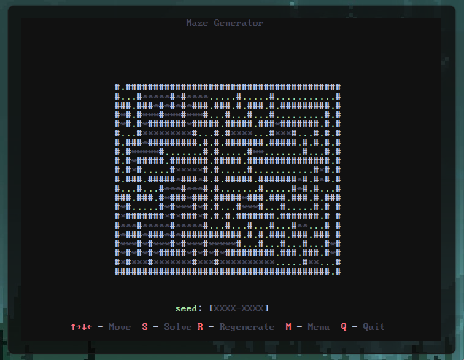

# Mazegen

Mazegen is a terminal-based TUI application that generates and solves mazes with an interactive, color-coded ncurses interface.



## Features

- **Dynamic Maze Generation:** Create random mazes with customizable dimensions.
- **Visualized Pathfinding:** Watch detailed animations as mazes are solved.
- **Color-Coded Display:** Differentiate walls, paths, exploration, and solutions.
- **Intuitive Navigation:** Pan large mazes using simple directional controls.
- **Adaptive UI:** Automatically adjusts to terminal resizing.
- **Customizable Experience:** Regenerate mazes with different seeds and settings.

## Controls

- **↑→↓←:** Navigate and pan the maze.
- **S:** Start solving the maze, with real-time visualization.
- **R:** Regenerate a new maze.
- **M:** Open the menu for additional options.
- **Q:** Exit the application.

## Installation

```bash
git clone https://github.com/Kubandir/maze.git
cd maze
chmod +x run.sh
sudo ./run.sh
mazegen
```
